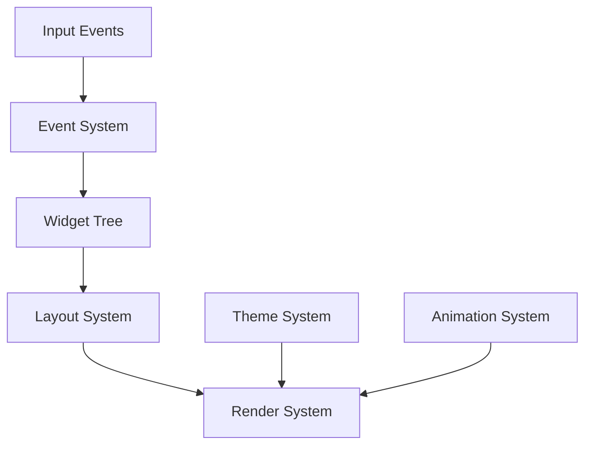

# Core Concepts

This document explains the fundamental concepts and architecture of QuUI SDK.

## Architecture Overview

QuUI is built on several core pillars:

### 1. Widget System

The widget system is the foundation of QuUI's UI hierarchy. Every visual element is a widget.

#### Widget Base
```cpp
class Widget {
    virtual void Update(float deltaTime);
    virtual void Render(Renderer* renderer);
    virtual void ProcessEvent(const Event& event);
};
```

### 2. Event System

The event system provides a robust way to handle user interactions and system events.

#### Event Types
- Input Events (Mouse, Keyboard, Touch)
- System Events (Window, Application)
- Custom Events

```cpp
// Example event handling
ui.AddEventHandler<MouseEvent>([](const MouseEvent& e) {
    if (e.type == MouseEvent::Type::Click) {
        // Handle click
    }
});
```

### 3. Layout System

The layout system manages the positioning and sizing of widgets.

#### Layout Types
- Flow Layout
- Grid Layout
- Stack Layout
- Flex Layout
- Free Layout

```cpp
// Example layout usage
auto container = std::make_shared<Container>();
container->SetLayout(std::make_shared<FlowLayout>());
container->Add(widget1);
container->Add(widget2);
```

### 4. Rendering System

Hardware-accelerated rendering system for smooth graphics.

#### Features
- Hardware acceleration
- Anti-aliasing
- Viewport management
- Clipping
- Custom shaders support

### 5. Theme System

Comprehensive theming system for consistent UI appearance.

```cpp
// Theme example
auto theme = std::make_shared<Theme>();
theme->SetColor("primary", Color(0.2f, 0.6f, 0.9f));
theme->SetColor("secondary", Color(0.9f, 0.3f, 0.2f));
ui.SetTheme(theme);
```

### 6. Animation System

Built-in animation system for smooth transitions and effects.

#### Animation Types
- Property animations
- Layout animations
- Color transitions
- Custom animations

```cpp
// Animation example
widget->Animate()
    .Property("opacity")
    .From(0.0f)
    .To(1.0f)
    .Duration(0.3f)
    .Easing(Easing::EaseInOut)
    .Start();
```

### 7. Resource Management

Centralized resource management for assets.

```cpp
auto& resources = ui.GetResourceManager();
resources.LoadFont("main", "fonts/main.ttf");
resources.LoadImage("logo", "images/logo.png");
resources.LoadShader("custom", "shaders/custom.glsl");
```

## Data Flow



## Memory Management

QuUI uses modern C++ memory management:

- Smart pointers for automatic resource management
- RAII principles
- Reference counting for shared resources
- Automatic cleanup

```cpp
// Memory management example
{
    auto context = ui.CreateContext();
    auto widget = std::make_shared<Widget>();
    context->AddWidget(widget);
    // Everything cleaned up automatically when context is destroyed
}
```

## Threading Model

QuUI uses a single-threaded model for UI operations:

- Main thread handles UI updates and rendering
- Background thread for resource loading
- Thread-safe event queue
- Async operations for heavy tasks

## Error Handling

QuUI uses exceptions for error handling:

```cpp
try {
    QUUI_INIT();
} catch (const QuUI::InitializationError& e) {
    std::cerr << "Failed to initialize: " << e.what() << std::endl;
} catch (const std::exception& e) {
    std::cerr << "Unexpected error: " << e.what() << std::endl;
}
```

## Performance Considerations

- Batched rendering
- Layout caching
- Event filtering
- Resource pooling
- Dirty region tracking

## Next Steps

- [Widget Reference](widget_reference.md)
- [Theme System](theme_system.md)
- [Layout Guide](layout_guide.md)
- [Animation Guide](animation_guide.md)